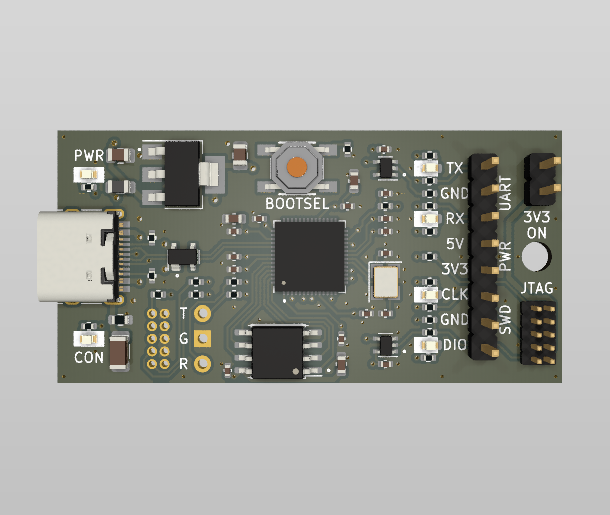
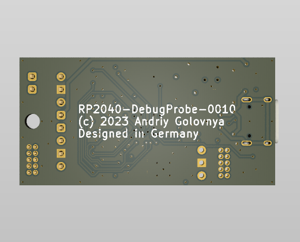
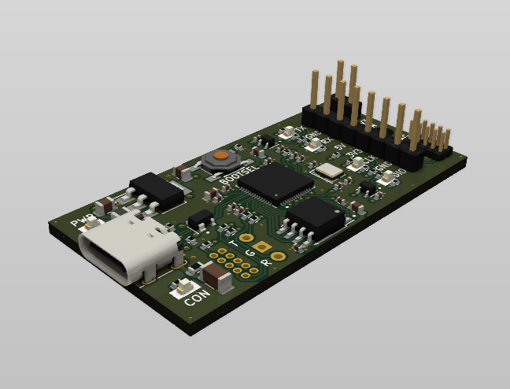

```
____________  _____  _____    ___ _____                
| ___ \ ___ \/ __  \|  _  |  /   |  _  |               
| |_/ / |_/ /`' / /'| |/' | / /| | |/' |               
|    /|  __/   / /  |  /| |/ /_| |  /| |               
| |\ \| |    ./ /___\ |_/ /\___  \ |_/ /               
\_| \_\_|    \_____/ \___/     |_/\___/                
______     _                ______          _          
|  _  \   | |               | ___ \        | |         
| | | |___| |__  _   _  __ _| |_/ / __ ___ | |__   ___ 
| | | / _ \ '_ \| | | |/ _` |  __/ '__/ _ \| '_ \ / _ \
| |/ /  __/ |_) | |_| | (_| | |  | | | (_) | |_) |  __/
|___/ \___|_.__/ \__,_|\__, \_|  |_|  \___/|_.__/ \___|
                        __/ |                          
                       |___/                           
```

# RP2040-DebugProbe Project

The **RP2040-DebugProbe** project aims to re-imagine Raspberry Pi Debug Probe.

## RP2040-DebugProbe Board

The **RP2040-DebugProbe** board is a 4-layer design intended to accommodate the popular Raspberry Pi RP2040 MCU with all required component to function identically to Raspberry Pi Debug Probe.

This board features target JTAG connector and PC host USB Type-C connector. It also has a SWD connector and UART connector for the main MCU debugging. The board is pin-compatible with Raspberry Pi Debug Probe and can be used with the same picoprobe SW.

Preview:





You can view the [Schematics in PDF format](doc/RP2040-DebugProbe.pdf) for detailed information.

STEP 3D file is available [with pins](doc/RP2040-DebugProbe.step).

Features:

- Very small form-factor of about 50x25mm (2x1in).
- Raspberry Pi RP2040 MCU as a heart of the board.
- 2x5 1.27mm JTAG connector for programming and debugging.
- 1x8 2.54mm SWD/UART/Power connector for programming and debugging.
- USB Type-C connector for power and communication.
- Several LEDs to indicate power and status.
- 2x5 1.27mm SWD connector and 1x3 2.54mm UART connector for main MCU debugging.
- BOOTSEL button to enter the bootloader mode for flashing new picoprobe SW.
- Pin-compatible with Raspberry Pi Debug Probe.
- Extra TARGET_RESET line connected to GPIO10 for target MCU reset over JTAG.

CAM files, as well as the BOM and CPL files for JLCPCB, are available.

## Version History

### v1.0b1


Initial release for testing purposes.

## Links

- [Raspberry Pi RP2040 information page](https://www.raspberrypi.com/documentation/microcontrollers/rp2040.html).
- [Raspberry Pi Debug Probe information page](https://www.raspberrypi.com/documentation/microcontrollers/debug-probe.html).
- [Picoprobe SW for the board](https://github.com/raspberrypi/picoprobe).

## How to Help

Your contributions as code, resources, or finances are welcome! Please contact me directly via email at andriy.golovnya@gmail.com or through my [GitHub profile](https://github.com/red-scorp).

If you'd like to make a financial contribution, you can donate via [PayPal](http://paypal.me/redscorp) or [Ko-Fi](http://ko-fi.com/redscorp). Your support is greatly appreciated.

Thanks in advance!